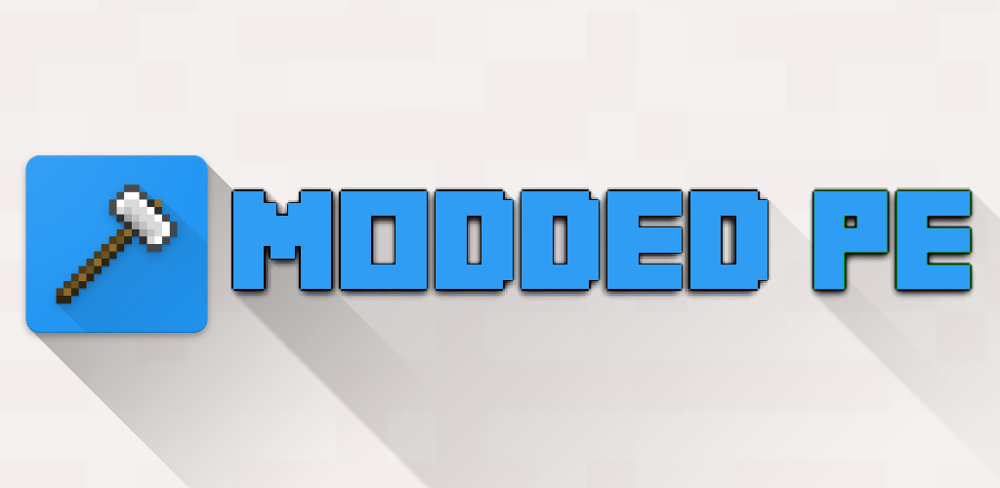

# ModdedPE

## What is ModdedPE?

ModdedPE is a launcher that allows you to run Minecraft PE and load NMods. ModdedPE can also be used as a library for your projects.

## ⚠️ Important Update

**The `app` module is outdated and has errors when importing mods.**
It is recommended to use the new **`app-x`** module, which is completely rewritten in Jetpack Compose with new interesting features.

## Project Modules

### 📱 Module `app-x` (recommended)
Modern version of the launcher with completely redesigned interface in Jetpack Compose.

### 🎮 Module `minecraft-app`
Module for creating Minecraft clones

1. Add resources to the path: `assets-pack/src/main/assets/..`
2. Create an archive with native libraries at the path: `minecraft-app/src/main/jniLibs/ABI/libgame.so` (zip: `libminecraftpe.so`/`libMediaDecoders_Android.so`/`libfmod.so`/`libc++_shared.so`...)

## NMOD Examples

Here are some samples that can help you develop NMods:
[NMod Examples][7] 

## NMod API

Would like to develop another mcpe launcher that can load NMods?
The Open Source NModAPI will help you a lot.
[NMod API][7] 

## Collaborators

### Additional components
> [XHook][4] 
[Cydia Substrate][5] 
[ELFIO][6] 

[1]: Art/title_logo.png
[2]: https://github.com/listerily
[4]: https://github.com/iqiyi/xHook
[5]: http://www.cydiasubstrate.com/
[6]: https://github.com/serge1/ELFIO
[7]: https://github.com/timscriptov/NModAPI
[8]: https://github.com/timscriptov/NMOD-Examples